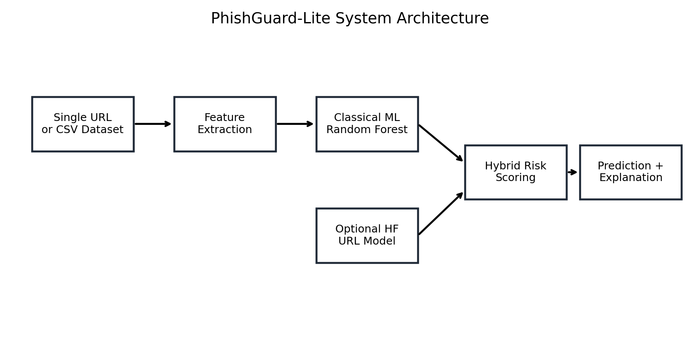
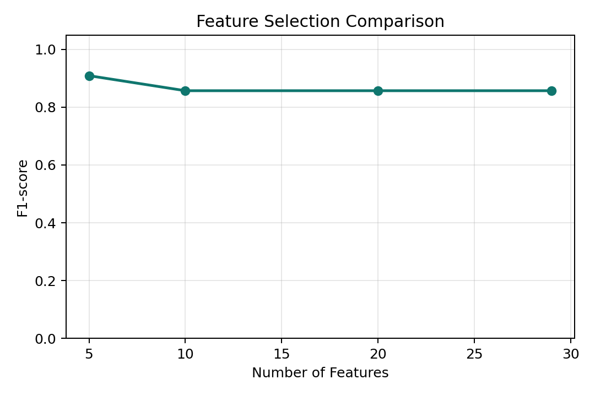
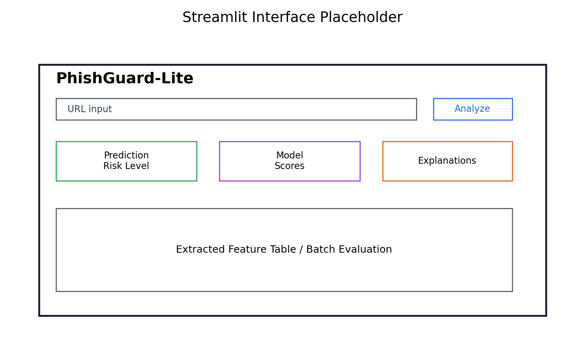
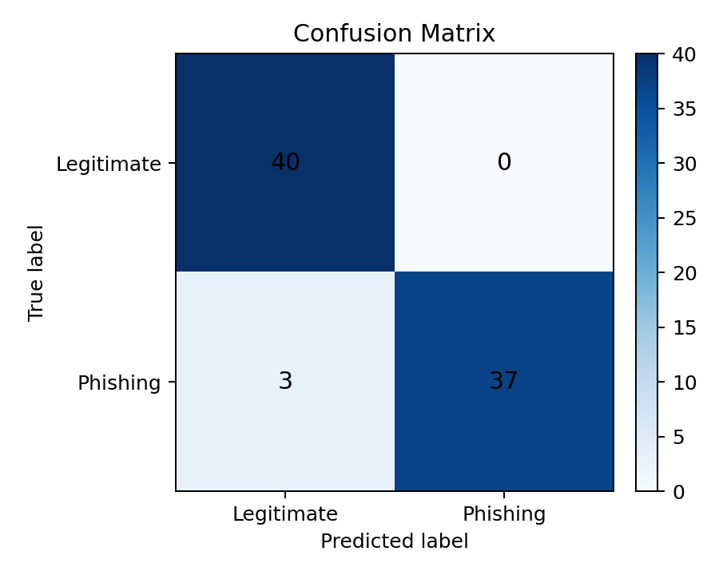
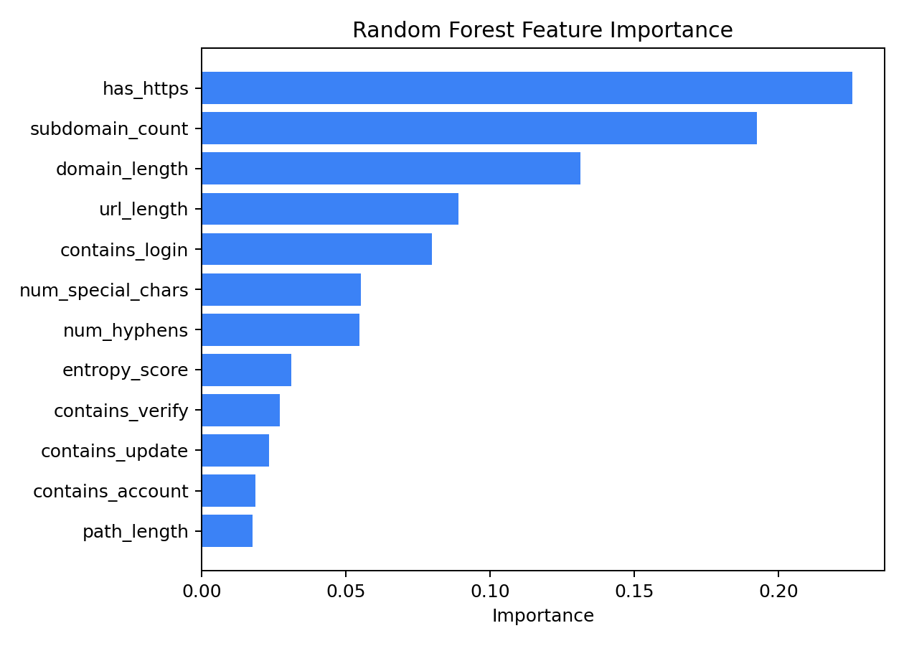

# PhishGuard-Lite: A Lightweight Hybrid Phishing Detection System Using Feature Selection and Pretrained Hugging Face Models

**Topic:** Lightweight Machine Learning-Based Phishing Detection with Feature Selection and Pretrained Models: A Practical Evaluation Study

**Project type:** University machine learning and cybersecurity prototype

---

## 1. Introduction

Phishing is a persistent cybersecurity problem in which attackers attempt to deceive users into visiting fraudulent websites, opening malicious links, or submitting sensitive information. Although phishing attacks are often delivered through email, text messages, social media, or collaboration platforms, the URL is frequently the final object the user must trust. For this reason, phishing URL detection is a practical and important defensive task.

Traditional phishing protection often relies on blacklists, browser warnings, or manually maintained threat intelligence feeds. These approaches are useful, but they have a delay problem: a newly created phishing URL may reach users before it appears in a blacklist. Attackers also modify domains, subdomains, paths, query strings, and URL shorteners to avoid exact-match detection. Machine learning can help by learning suspicious URL patterns rather than only checking whether a URL is already known.

This project presents **PhishGuard-Lite**, a lightweight phishing URL detection prototype. It combines handcrafted URL features, feature selection, classical machine learning models, optional pretrained Hugging Face models, a character n-gram URL text model, an optional character-level neural network, and a transparent hybrid risk score. The goal is not to claim production-level phishing protection. The goal is to build a clean, runnable, explainable university project that demonstrates how multiple defensive detection strategies can be combined.

The system supports two main workflows. First, a user can enter a single URL and receive a final prediction, risk level, confidence score, classical model result, Hugging Face result when available, rule-based score, suspicious indicators, and extracted feature table. Second, a labeled CSV dataset can be evaluated to produce accuracy, precision, recall, F1-score, true positive rate, false positive rate, confusion matrix, average prediction latency, feature importance, and feature selection comparisons.

To move beyond the small synthetic demonstration dataset, the project was also evaluated on the UCI Machine Learning Repository **PhiUSIIL Phishing URL (Website)** dataset. This external evaluation gives the report a more realistic basis for discussing model performance, while still keeping the prototype lightweight and safe to run locally.

## 2. Background

Phishing detection can be approached in several ways. Blacklist-based systems compare URLs against databases of known malicious links. Content-based systems inspect HTML, page text, forms, scripts, screenshots, and visual similarity. Network-based systems may use DNS records, WHOIS information, certificate metadata, hosting details, or domain age. Machine learning systems attempt to learn patterns that distinguish phishing and legitimate examples.

PhishGuard-Lite focuses mainly on **URL-based phishing detection**. URL-only detection is attractive for a classroom prototype because it is fast, does not require crawling potentially dangerous webpages, and can be demonstrated safely. A URL can reveal useful signals such as length, number of subdomains, use of IP addresses, use of suspicious keywords, high character entropy, unusual punctuation, or brand names placed outside official domains.

URL-only detection also has limitations. A legitimate website may contain words such as `login`, `account`, or `secure`. A phishing URL may use HTTPS and a clean-looking domain. Therefore, no single feature should be treated as proof of phishing. The system instead combines many weak signals and estimates risk.

Classical machine learning is suitable for structured URL features. Logistic Regression provides a simple linear baseline. Random Forest can model nonlinear feature interactions and provide feature importance. Linear SVM is a lightweight margin-based classifier. Gradient Boosting is a stronger tree-based model that can capture nonlinear structure. In this project, Random Forest remains the main deployable model because it is accurate, fast, and interpretable enough for a student system.

Pretrained transformer models and other deep learning approaches offer a different view. They process URLs as text and may learn token patterns from larger training data. However, pretrained models require more resources and may fail to load without internet access. For this reason, PhishGuard-Lite treats Hugging Face integration as optional and includes fallback behavior.

## 3. Related Work and Paper Connection

The referenced academic direction focuses on phishing detection, feature selection, machine learning, and deep learning or pretrained models. PhishGuard-Lite connects to this direction in five ways:

1. It uses phishing URL detection as the main cybersecurity problem.
2. It extracts handcrafted URL features.
3. It applies feature selection to compare full and reduced feature sets.
4. It evaluates multiple lightweight classical machine learning models.
5. It adds pretrained/deep learning style variants through Hugging Face inference, character TF-IDF modeling, and an optional character-CNN.

This project is a **practical adaptation**, not a full reproduction of a referenced paper. A full reproduction would require the original dataset, preprocessing assumptions, model configurations, hyperparameters, train/test protocol, and direct comparison with the paper's reported values. PhishGuard-Lite instead implements the central ideas in a smaller and more explainable system suitable for a university project.

The project also reflects an important lesson from phishing detection research: more features or more complex models do not automatically produce better systems. Feature quality, dataset quality, evaluation design, and deployment constraints matter. The optional character-CNN included in this project is useful for increasing technical difficulty, but its benchmark result shows that a simple neural model trained briefly is not necessarily superior to strong lightweight baselines.

## 4. System Design

PhishGuard-Lite is organized as a modular Python project. The major components are:

- `feature_extraction.py`: converts URLs into numeric handcrafted features.
- `feature_selection.py`: computes mutual information and permutation-importance based feature rankings.
- `classical_models.py`: trains Logistic Regression, Random Forest, Linear SVM, and Gradient Boosting models.
- `url_text_models.py`: trains a character TF-IDF plus Logistic Regression URL text model.
- `deep_url_model.py`: trains an optional lightweight character-CNN.
- `hf_model.py`: lazily loads optional pretrained Hugging Face URL classifiers.
- `hybrid_detector.py`: combines classical ML, Hugging Face output, and rule-based scores.
- `explanation.py`: generates human-readable suspicious indicators.
- `app.py`: provides a Streamlit interface for single URL analysis and dataset evaluation.
- `real_dataset_eval.py`: evaluates the system on the UCI PhiUSIIL dataset.

For single URL prediction, the system extracts handcrafted features, obtains a classical phishing score, optionally obtains a Hugging Face score, computes a rule-based score, combines these values into a final hybrid score, and displays explanations. For dataset evaluation, the system processes a CSV file or the UCI dataset and reports quantitative metrics.

**Figure 1. System architecture**



This design is intentionally practical. The system can run without Hugging Face, without crawling live websites, and without requiring a GPU. More advanced components are available, but the baseline remains lightweight.

## 5. Feature Extraction

Feature extraction converts a URL into a fixed numeric vector. The extractor is robust against missing URL schemes and malformed input. If a URL does not include `http://` or `https://`, the parser adds a temporary scheme so that standard URL parsing can still be applied.

The features are grouped into structural, lexical, keyword, and risk-indicator categories. Structural features include total URL length, domain length, path length, query length, number of dots, number of slashes, path depth, and subdomain count. Lexical features include the number of hyphens, digits, special characters, and Shannon entropy. Risk indicators include IP address usage, `@` symbols, double-slash redirect patterns, suspicious top-level domains, and URL shorteners. Keyword features detect terms commonly used in credential theft lures, such as `login`, `verify`, `secure`, `account`, `update`, and `bank`, as well as brand names such as `paypal`, `google`, `microsoft`, `apple`, and `amazon`.

**Table 1. Extracted URL features**

| Feature | Description |
|---|---|
| `url_length` | Total number of characters in the URL |
| `domain_length` | Number of characters in the host/domain |
| `path_length` | Number of characters in the URL path |
| `query_length` | Number of characters in the query string |
| `num_dots` | Count of dot characters |
| `num_hyphens` | Count of hyphen characters |
| `num_digits` | Count of numeric characters |
| `num_special_chars` | Count of non-alphanumeric characters |
| `num_slashes` | Count of slash characters |
| `subdomain_count` | Number of subdomain parts |
| `path_depth` | Number of path segments |
| `has_https` | Whether the URL uses HTTPS |
| `has_ip_address` | Whether the host appears to be an IPv4 address |
| `has_at_symbol` | Whether the URL contains an `@` symbol |
| `has_double_slash_redirect` | Whether path or query contains a double-slash redirect-like pattern |
| `has_suspicious_tld` | Whether the top-level domain appears in a suspicious TLD list |
| `has_url_shortener` | Whether the registered domain is a known URL shortener |
| `contains_*` | Keyword indicators for credential terms and selected brand names |
| `entropy_score` | Shannon entropy of the URL string |

These features are intentionally simple. They are useful for speed and explainability, but they cannot represent all phishing behavior. For example, HTTPS is now common on both legitimate and phishing websites. Similarly, a real login page naturally contains account-related keywords.

## 6. Feature Selection

Feature selection is included because the project topic emphasizes lightweight detection. Reducing the feature set can lower complexity, reduce noise, and make the system easier to explain. It can also show whether the full feature list is necessary.

The project implements two feature selection methods:

- **Permutation importance:** measures how model performance changes when a feature is randomly shuffled.
- **SelectKBest with mutual information:** estimates statistical dependence between each feature and the label.

The sample-data experiment compares all 29 features against the top 20, top 10, and top 5 mutual information features. The feature lists are saved as JSON files for inspection and reuse.

**Figure 5. Feature selection comparison**



**Table 2. Feature selection results on the demonstration dataset**

| Feature set | Number of features | F1-score |
|---|---:|---:|
| All features | 29 | 0.8571 |
| Top 20 mutual information features | 20 | 0.8571 |
| Top 10 mutual information features | 10 | 0.8571 |
| Top 5 mutual information features | 5 | 0.9091 |

The demonstration result suggests that a reduced feature set can perform competitively. However, because the demonstration dataset is small and synthetic, this result should be interpreted as a feature-selection workflow check rather than a final scientific conclusion.

## 7. Classical Machine Learning Models

The classical machine learning layer trains four models:

- Logistic Regression
- Random Forest
- Linear SVM
- Gradient Boosting

The main deployable model is Random Forest because it handles nonlinear feature relationships, works well on tabular data, and provides feature importance. Logistic Regression is useful as a simple baseline. Linear SVM gives another lightweight comparison. Gradient Boosting is included because it often performs strongly on structured features.

The training script reads a labeled CSV file, extracts URL features, splits the data into training and test sets, trains each model, evaluates metrics, and saves model bundles with Joblib.

**Table 3. Classical model comparison on the demonstration dataset**

| Model | Accuracy | Precision | Recall | F1-score |
|---|---:|---:|---:|---:|
| Logistic Regression | 0.9167 | 1.0000 | 0.8333 | 0.9091 |
| Random Forest | 0.8750 | 1.0000 | 0.7500 | 0.8571 |
| Linear SVM | 0.9167 | 1.0000 | 0.8333 | 0.9091 |
| Gradient Boosting | 0.9167 | 1.0000 | 0.8333 | 0.9091 |

These numbers come from the small safe demonstration dataset. They are useful for checking the local pipeline, but the UCI evaluation in Section 11 is more meaningful.

## 8. Pretrained Hugging Face Model Integration

The Hugging Face layer is implemented as a lazy-loading wrapper around pretrained text-classification models. The wrapper can attempt to load models such as:

- `CrabInHoney/urlbert-tiny-v4-phishing-classifier`
- `CrabInHoney/urlbert-tiny-v4-malicious-url-classifier`
- `Eason918/malicious-url-detector-v2`
- `darshan8950/phishing_url_detection_BERT`

The model is loaded only when the user enables the Hugging Face layer and requests prediction. This avoids unnecessary startup time and makes classroom demonstrations reliable. If loading fails because of missing internet access, unavailable model files, memory limits, dependency problems, or unsupported model formats, the system returns an unavailable result rather than crashing.

In addition to Hugging Face inference, the project adds two local URL-text learning variants:

- **Character TF-IDF + Logistic Regression:** a lightweight model that learns from raw URL character n-grams.
- **Character-CNN URL model:** an optional PyTorch neural network that learns character embeddings and convolutional URL patterns.

These additions increase the technical difficulty of the project while preserving the defensive and educational scope. They also allow comparison between handcrafted features, text-based machine learning, and a small deep learning model.

## 9. Hybrid Risk Scoring and Explainability

The hybrid risk engine combines three sources of evidence:

- Classical machine learning phishing score
- Hugging Face phishing score, when available
- Rule-based risk score

When Hugging Face inference is available, the formula is:

```text
final_score = 0.40 * classical_ml_score + 0.40 * hf_score + 0.20 * rule_score
```

When Hugging Face inference is disabled or unavailable, the fallback formula is:

```text
final_score = 0.70 * classical_ml_score + 0.30 * rule_score
```

Risk levels are defined as:

- LOW: final score below 0.40
- MEDIUM: final score from 0.40 to below 0.70
- HIGH: final score of 0.70 or higher

The final prediction is phishing when the final score is at least 0.50. Otherwise, the prediction is legitimate.

The explanation layer gives simple human-readable reasons based on activated features. Example explanations include: "URL is unusually long", "URL contains an IP address instead of a normal domain", "URL contains credential-related keyword: login", and "URL contains a brand name outside the official domain." These explanations are not full formal explainable AI. They are transparent rule-based indicators designed for classroom presentation and user understanding.

## 10. Experimental Setup

The project uses two evaluation settings.

The first setting is a small safe demonstration dataset in `data/sample_urls.csv`. It uses synthetic suspicious-looking examples and harmless legitimate examples. This dataset is useful for local testing and classroom demonstrations, but it is not a real benchmark.

The second setting is the UCI Machine Learning Repository **PhiUSIIL Phishing URL (Website)** dataset, dataset ID 967. The dataset contains 235,795 examples: 100,945 phishing and 134,850 legitimate. It includes a raw `URL` column, URL-derived features, and webpage-derived features. To keep the evaluation aligned with PhishGuard-Lite's URL-only design, the benchmark uses the raw `URL` column and extracts this project's own features from it.

One important preprocessing step is label conversion. The UCI dataset uses:

```text
0 = phishing
1 = legitimate
```

PhishGuard-Lite uses:

```text
0 = legitimate
1 = phishing
```

Therefore, the evaluation script converts the UCI labels before training and testing. For runtime control, the reported UCI experiment uses a balanced 30,000-row sample from the full dataset. The optional character-CNN uses a bounded subset of 12,000 total examples because neural training is slower on a normal laptop.

The evaluation metrics are accuracy, precision, recall, F1-score, true positive rate, false positive rate, confusion matrix, training time, and prediction latency. Recall is important because false negatives mean phishing URLs are missed. Precision is also important because too many false positives can reduce user trust.

**Figure 2. Streamlit interface**



## 11. Results

The demonstration dataset verifies that the basic pipeline works. The saved Random Forest model achieved an overall evaluation accuracy of 0.9625, precision of 1.0000, recall of 0.9250, and F1-score of 0.9610 when evaluated across the demonstration CSV. These results should not be treated as real-world performance because the dataset is small and contains synthetic phishing-style examples.

**Figure 3. Demonstration confusion matrix**



**Figure 4. Random Forest feature importance**



**Table 4. Latency comparison on the local demonstration pipeline**

| Component | Average latency | Notes |
|---|---:|---|
| Classical ML model | 0.003701 seconds | Random Forest over handcrafted features |
| Rule-based layer | 0.000027 seconds | Transparent feature threshold scoring |
| Hugging Face model | Not measured by default | Depends on model download, hardware, and selected model |

The more important evaluation is the UCI PhiUSIIL experiment. The table below reports results on a balanced 30,000-row UCI sample, except for the character-CNN, which was trained on a bounded subset for runtime control.

**Table 5. UCI PhiUSIIL real-dataset benchmark results**

| Model | Rows | Accuracy | Precision | Recall | F1-score | False positive rate |
|---|---:|---:|---:|---:|---:|---:|
| Handcrafted features + Logistic Regression | 30,000 | 0.9915 | 1.0000 | 0.9830 | 0.9914 | 0.0000 |
| Handcrafted features + Random Forest | 30,000 | 0.9947 | 1.0000 | 0.9893 | 0.9946 | 0.0000 |
| Handcrafted features + Linear SVM | 30,000 | 0.9913 | 1.0000 | 0.9827 | 0.9913 | 0.0000 |
| Handcrafted features + Gradient Boosting | 30,000 | 0.9952 | 0.9997 | 0.9907 | 0.9951 | 0.0003 |
| Character TF-IDF + Logistic Regression | 30,000 | 0.9932 | 1.0000 | 0.9863 | 0.9931 | 0.0000 |
| Character-CNN URL model | 12,000 | 0.9862 | 1.0000 | 0.9723 | 0.9860 | 0.0000 |

**Figure 6. UCI PhiUSIIL Random Forest confusion matrix**


**Figure 7. UCI PhiUSIIL character TF-IDF confusion matrix**


The UCI results show that the handcrafted URL features perform strongly on the sampled real dataset. Gradient Boosting achieved the highest F1-score, followed closely by Random Forest and the character TF-IDF model. The character TF-IDF model is valuable because it learns directly from URL text instead of manually engineered features. The character-CNN result is slightly lower after one epoch of bounded training, which is a useful reminder that deep learning is not automatically better than lightweight baselines, especially when training time and dataset size are limited.

## 12. Discussion

The results support the main goal of the project: a lightweight URL-based phishing detector can be accurate, fast, explainable, and easy to run locally. On the UCI sample, both structured handcrafted features and raw character n-gram text features achieved strong performance. This suggests that phishing URLs often contain measurable lexical and structural patterns.

The comparison between models is also instructive. Random Forest is a good main model because it balances performance, speed, and interpretability. Gradient Boosting achieved the best reported UCI F1-score, but Random Forest remains easier to explain through feature importance. Logistic Regression and Linear SVM performed well, showing that the feature representation itself is highly informative. The character TF-IDF model performed competitively, making it a useful additional model for project difficulty. The character-CNN worked, but did not outperform the simpler methods in the bounded experiment.

False positives and false negatives should be interpreted carefully. A false positive blocks or warns about a legitimate URL, which can frustrate users. A false negative allows a phishing URL through, which is more dangerous from a security perspective. In a real deployment, the decision threshold could be adjusted depending on whether the priority is reducing false positives or reducing missed phishing attempts.

The high UCI scores are encouraging but should not be exaggerated. The UCI dataset may contain separable patterns that are easier than current adversarial phishing campaigns. A real-world deployment would require continuous evaluation on fresh data, monitoring for drift, and integration with other signals beyond the URL string.

## 13. Limitations

This project has several limitations:

- The small built-in dataset is synthetic and should only be used for demonstration.
- The UCI benchmark uses a balanced 30,000-row sample, not the full dataset in the reported run.
- The UCI experiment uses only the raw URL column, not all webpage-derived PhiUSIIL features.
- The system mainly performs URL-only detection and does not inspect live webpage content.
- The Hugging Face model layer may be unavailable without internet access or sufficient resources.
- The character-CNN was trained for a bounded one-epoch experiment and was not fully optimized.
- Rule-based explanations are understandable but are not full formal XAI.
- The feature set does not include WHOIS data, domain age, DNS records, certificate metadata, hosting reputation, or live threat intelligence.
- Attackers can create adversarial URLs that avoid obvious suspicious indicators.

These limitations do not invalidate the project. They define its scope as a defensive, educational, lightweight prototype rather than a production phishing protection system.

## 14. Future Work

Future work could improve the project in several ways. A browser extension could analyze links directly while a user browses. Live webpage text extraction could add page titles, visible text, forms, login fields, and script indicators. WHOIS and domain age features could help detect newly registered suspicious domains. DNS, TLS certificate, hosting, and reputation features could add more security context.

The machine learning side could also be extended. The full UCI dataset could be evaluated with cross-validation. The character-CNN could be trained longer and tuned more carefully. Transformer fine-tuning could be attempted on URL text if computing resources are available. SHAP or other local explanation methods could be added for stronger explainability. Adversarial URL testing would be especially valuable because attackers intentionally design URLs to bypass detection rules.

## 15. Conclusion

PhishGuard-Lite demonstrates a practical lightweight phishing URL detection system. It combines handcrafted feature extraction, feature selection, classical machine learning, optional Hugging Face pretrained inference, character n-gram URL modeling, an optional character-CNN, hybrid risk scoring, and simple explanations. The project is a practical adaptation of research ideas around phishing detection, feature selection, and pretrained/deep learning models, not a full reproduction of any specific paper.

The project's strongest result is that the same system can support both classroom demonstration and external dataset evaluation. On the UCI PhiUSIIL sample, lightweight models achieved strong accuracy and F1-scores while remaining fast and explainable. At the same time, the report is careful not to overstate the result: URL-only detection is useful but incomplete, and real phishing defense requires broader signals, fresh data, and continuous evaluation.

## 16. References

1. Scikit-learn Developers. *Scikit-learn: Machine Learning in Python*. https://scikit-learn.org/
2. Hugging Face. *Transformers Documentation*. https://huggingface.co/docs/transformers/
3. Streamlit. *Streamlit Documentation*. https://docs.streamlit.io/
4. UCI Machine Learning Repository. *PhiUSIIL Phishing URL (Website) Dataset*. Dataset ID 967. https://archive.ics.uci.edu/
5. OWASP. *Phishing and Social Engineering Security Guidance*. https://owasp.org/
6. NIST. *Cybersecurity Framework*. https://www.nist.gov/cyberframework
7. Breiman, L. (2001). Random Forests. *Machine Learning*, 45, 5-32.
8. Pedregosa, F. et al. (2011). Scikit-learn: Machine Learning in Python. *Journal of Machine Learning Research*, 12, 2825-2830.

## Classroom Presentation Section

### Demo steps

1. Open the app with `streamlit run app.py`.
2. Start with the single URL tab.
3. Enter a clearly synthetic suspicious URL such as `https://paypal.verify-account.example-login.test/security/update`.
4. Show the final prediction, risk level, confidence score, model comparison, and explanations.
5. Show the extracted feature table and connect it to Table 1 in the report.
6. Move to batch evaluation and upload `data/sample_urls.csv`.
7. Show the confusion matrix and feature importance chart.
8. Open the Real Dataset Results tab and show the UCI PhiUSIIL benchmark table.
9. Explain why the UCI label conversion was necessary.
10. Compare Random Forest, Gradient Boosting, character TF-IDF, and character-CNN results.

### What to show first

Start with the single URL analysis because it is the easiest part for the audience to understand. Then show feature explanations to connect the interface to the machine learning pipeline. After that, show the real UCI benchmark results to demonstrate that the project was tested beyond the synthetic demo dataset.

### What results to explain

Explain accuracy, precision, recall, F1-score, true positive rate, false positive rate, confusion matrix, feature importance, and latency. Emphasize recall because missed phishing URLs are dangerous. Also explain precision because too many false warnings reduce user trust. For the deep learning variant, explain that the character-CNN worked but did not beat the simpler baselines in the bounded run.

### Likely teacher questions and short answers

**Question:** Is this a full reproduction of the referenced paper?  
**Answer:** No. It is a practical adaptation. It uses the same broad ideas of phishing detection, feature selection, machine learning, and pretrained/deep models, but it does not reproduce the exact original dataset or protocol.

**Question:** Why use URL-only detection?  
**Answer:** URL-only detection is lightweight, fast, and safe because the system does not need to visit suspicious websites. It is useful as an early warning layer, but it is not complete protection.

**Question:** Why was the UCI label conversion necessary?  
**Answer:** The UCI PhiUSIIL dataset uses `0 = phishing` and `1 = legitimate`, while this project uses `0 = legitimate` and `1 = phishing`. Without conversion, the evaluation would be wrong.

**Question:** Why does the character-CNN not outperform the classical models?  
**Answer:** Deep learning is not automatically better. The CNN was trained in a bounded one-epoch experiment for runtime control, while the handcrafted features are highly informative for this dataset.

**Question:** Why keep Random Forest as the main model if Gradient Boosting scored slightly higher?  
**Answer:** Random Forest is accurate, fast, stable, and easier to explain with feature importance. Gradient Boosting is a strong comparison model but not necessarily the best classroom-facing default.

**Question:** What happens if the Hugging Face model fails to load?  
**Answer:** The system continues running with the classical model and rule-based layer using the fallback hybrid formula.

**Question:** Can this detect all phishing URLs?  
**Answer:** No. It is a prototype. Real phishing defense requires fresh datasets, live threat intelligence, content analysis, domain metadata, and continuous monitoring.
